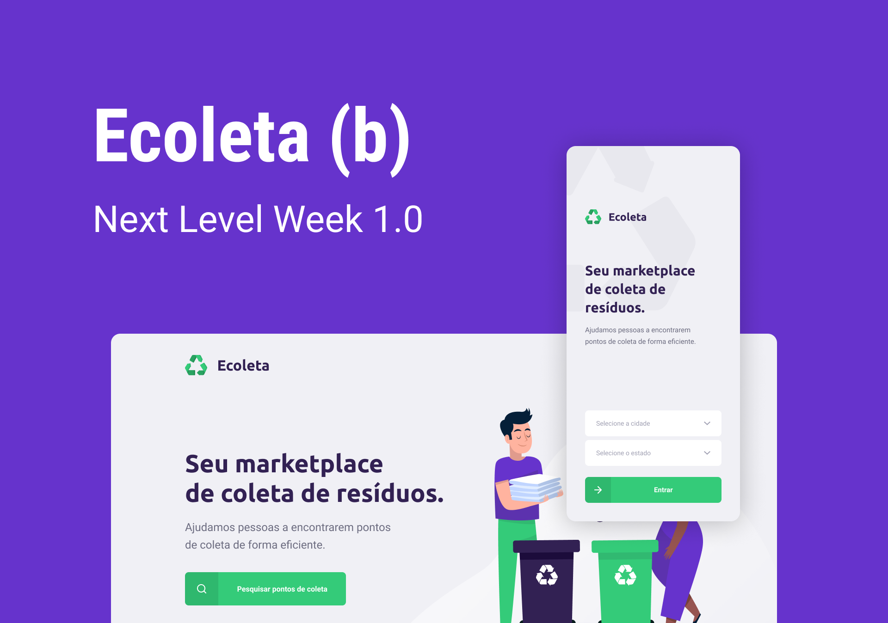

<h1 align="center">
    
</h1>

## 🤔 Next Level Week?

[NLW](https://nextlevelweek.com/) is an intensive one week long event where we develop a whole application from scratch.

## 🤓 Project

Since the event took place during the environment week, the project was a marketplace to connect collection centers and people.

The web application is where we register collection centers, and the mobile application is how we find centers around us.

## 😍 Technologies

<table>
<tr><th>Backend</th><th>Web</th><th>Mobile</th></tr>
<tr>
<td>[Node.js][node_url]</td>
<td>[React][react_url]</td>
<td>[React Native][react_native_url]</td>
</tr>
<tr>
<td colspan="3" align="center">[TypeScript][typescript_url]</td>
</tr>
<tr>
<td>[ExpressJS][express_url]</td>
<td></td>
<td>[Expo][expo_url]</td>
</tr>
</table>

## 🙃 Installation

After cloning this repository, just install the packages and run each of them.

```bash
$ git clone https://github.com/cleiver/Rocketseat-NLW01-Ecoleta.git ecoleta
```

### Backend

```bash
$ cd ecoleta/api

# Install dependencies
$ yarn install

# Create database tables (sqlite3)
$ yarn knex:migrate

# Create default values
$ yarn knex:seed

# Start server
$ yarn dev
```

### Frontend

```bash
$ cd ecoleta/web

# Install dependencies
$ yarn install

# Run
$ yarn start
```

### Mobile

```bash
$ cd ecoleta/mobile

# Install dependencies
$ yarn install

# Run
$ yarn start
```

A window will open, scan the qrcode using the [Expo App](https://play.google.com/store/apps/details?id=host.exp.exponent).


[node_url]: https://nodejs.org
[react_url]: https://reactjs.org
[react_native_url]: https://facebook.github.io/react-native
[typescript_url]: https://www.typescriptlang.org
[express_url]: typescript_url
[expo_url]: https://expo.io
